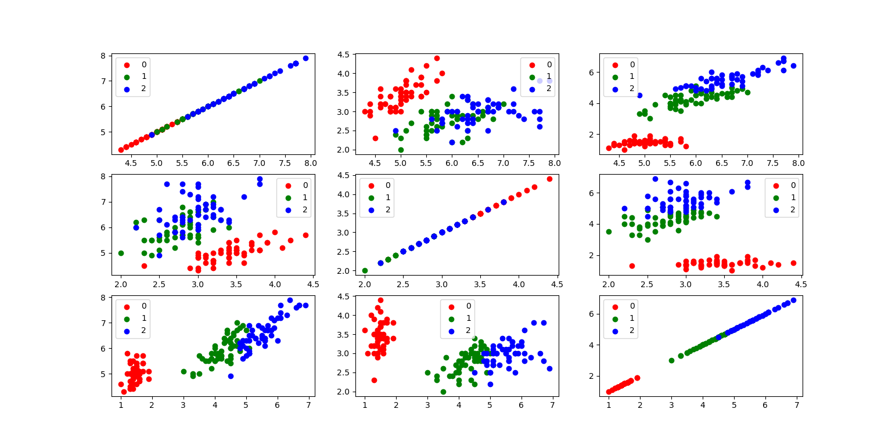
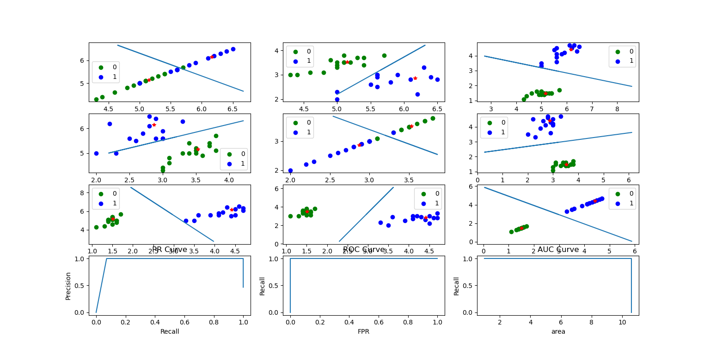
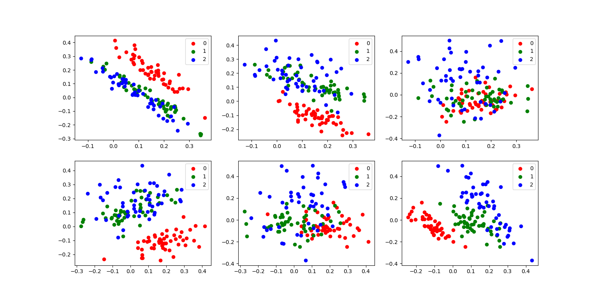
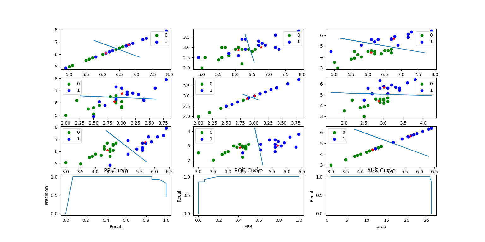

# 《机器学习》上机实践（1）

 

> 实验题：（本题使用MATLAB或Python完成均可）实验题：（本题使用MATLAB或Python完成均可，如果使用其他平台，数据集需要去这里下载https://archive.ics.uci.edu/ml/datasets/Iris）

 

> 注：本题包括公式推导需要给出推导过程，相关核心代码部分需自己完成，禁止调用库函数，否则没有成绩，边缘部分，例如可视化等，可以使用库函数实现。

 

> Iris数据集（鸢尾花数据集）是常用的分类实验数据集，由Fisher于1936收集整理。数据集包含150个数据样本，分为3类，每类50个数据，每个数据包含4个属性。4个属性分别为花萼长度，花萼宽度，花瓣长度，花瓣宽度，单位是cm。3个类别分别为Setosa（山鸢尾），Versicolour（杂色鸢尾），Virginica（维吉尼亚鸢尾）。

 

1. Iris数据集已与常见的机器学习工具集成，请查阅资料找出MATLAB平台或Python平台加载内置Iris数据集方法，并简要描述该数据集结构。

```
{'data': array([[5.1, 3.5, 1.4, 0.2],
               [4.9, 3. , 1.4, 0.2],
               [4.7, 3.2, 1.3, 0.2]，
 'target': array([0, 0, 0, 0, ···
 'frame': None, 
 'target_names' ···}
```
> 数据集是一个map，其中data中含有150个数据，每个数据有四个属性值；target中为data中数据对应的分类，有0-2共三种；target_names中为分类值所对应的花名

2. Iris数据集中有一个种类与另外两个类是线性可分的，其余两个类是线性不可分的。请你通过数据可视化的方法找出该线性可分类并给出判断依据。

Iris.py

```python
from sklearn import datasets
import matplotlib.pyplot as plt
import pandas as pd


#加载数据集，是一个字典类似Java中的map
Iris = datasets.load_iris()
#print(Iris)


#数据集预处理
Iris_df = pd.DataFrame(Iris.data)
Iris_df.insert(0,'target',Iris.target)
#按目标分类
Iris_div = []
for i in range(0,3):
    Iris_div.append(Iris_df[Iris_df['target']==i])

#颜色表
colmaps = ['red', 'green', 'blue']

for i in range(0,3):
    for j in range(0,3):
        for k in range(0,3):
            #挑选出ij两个维度作为x轴和y轴，k作为目标种类
            x_axis = Iris_div[k][i]
            y_axis = Iris_div[k][j]
            #画ij子图的第k种颜色
            plt.subplot(3,3,3*i+j+1)
            plt.scatter(x_axis, y_axis, c=colmaps[k], label=k)
            #添加图例
            plt.legend()

plt.show()
```


> 0是线性可分的，可以通过一个线性函数将其与另外两个类分开

3.去除Iris数据集中线性不可分的类中最后一个，余下的两个线性可分的类构成的数据集命令为Iris_linear，请使用留出法将Iris_linear数据集按7:3分为训练集与测试集，并使用训练集训练一个MED分类器，在测试集上测试训练好的分类器的性能，给出《模式识别与机器学习-评估方法与性能指标》中所有量化指标并可视化分类结果。
MED.py

```python
from sklearn import datasets
import matplotlib.pyplot as plt
import pandas as pd
import numpy as np
import math


class MED(object):
    #初始化
    def __init__(self):
        self.vecotr_length = 0 
        self.center_coordinates = {} #计算向量之和并最后求均值
        self.point_number = {} #统计向量个数
        self.score = []

    #向量距离
    def __distance(self, x, y):
        #print(x)
        #print(y)
        tot = 0
        for i in range(0,self.vecotr_length):
            tot += (x[i]-y[i])*(x[i]-y[i])
        return math.sqrt(tot)

    #留出法
    def div(self, data):
        #生成训练集
        Iris_linear_train = data.iloc[0:int(len(data)*0.7)]
        #print(Iris_linear_train)
        X_train = Iris_linear_train[[0, 1, 2]]
        Y_train = Iris_linear_train['target']
        #print(X_train)
        #print(Y_train)

        #生成测试集
        Iris_linear_test = data.iloc[int(len(data)*0.7):len(data)].reset_index(drop=True)
        #print(Iris_linear_test)
        X_test = Iris_linear_test[[0, 1, 2]]
        Y_test = Iris_linear_test['target']
        #print(X_test)
        #print(Y_test)
        return X_train , Y_train , X_test , Y_test

    #训练
    def fit(self, X_train, Y_train):
        self.vecotr_length = len(X_train.columns)
        #计算向量之和
        for i in X_train.index:
            x = X_train.iloc[i]
            y = Y_train.iloc[i]
            if y not in self.center_coordinates.keys():
                self.center_coordinates[y]=x
                self.point_number[y]=0
            else:
                self.center_coordinates[y]=self.center_coordinates[y].add(x)
                self.point_number[y]+=1
        #计算均值
        for i in self.center_coordinates:
            self.center_coordinates[i]=self.center_coordinates[i]/self.point_number[i]
    
    #打分
    def __score(self, X_test):
        self.Y_score = []
        for i in X_test.index:
            x = X_test.iloc[i]
            total = 0
            for j in self.center_coordinates:
                total += 1/self.__distance(x, self.center_coordinates[j])
            score = 1/self.__distance(x, self.center_coordinates[1]) / total
            self.Y_score.append(score)
        return self.Y_score

    def __TFNP(self, Y_scores, Y_test, thresholds):
        TP , FP , TN , FN = 0 , 0 , 0 , 0
        for i in range(0,len(Y_scores)):
            if Y_scores[i] >= thresholds:
                if  Y_test[i] == 1:
                    TP += 1
                else:
                    FP += 1
            else:
                if  Y_test[i] == 1:
                    FN += 1
                else:
                    TN += 1
        return TP , FP , TN , FN

    #评估
    def evaluate(self, X_test, Y_test):
        Y_score = self.__score(X_test)

        #数据集预处理
        Iris_df = pd.DataFrame(X_test)
        Iris_df.insert(0,'target',Y_test)
        #按目标分类
        Iris_div = []
        for i in range(0,2):
            Iris_div.append(Iris_df[Iris_df['target']==i])
        #颜色表
        colmaps = ['green', 'blue']
        for i in range(0,3):
            for j in range(0,3):
                plt.subplot(4,3,3*i+j+1)
                for k in range(0,2):
                    #挑选出ij两个维度作为x轴和y轴，k作为目标种类
                    x_axis = Iris_div[k][i]
                    y_axis = Iris_div[k][j]
                    #画ij子图的第k种颜色
                    plt.scatter(x_axis, y_axis, c=colmaps[k], label=k)
                    #画类均值中心
                    plt.plot(self.center_coordinates[k][i], self.center_coordinates[k][j], marker='*', c='red')
                #画决策边界
                #连线向量
                vector_linear_x = self.center_coordinates[0][i]-self.center_coordinates[1][i]
                vector_linear_y = self.center_coordinates[0][j]-self.center_coordinates[1][j]
                #垂线向量
                vector_vertical_x = vector_linear_y
                vector_vertical_y = -vector_linear_x
                #中点坐标
                mid_x = (self.center_coordinates[0][i]+self.center_coordinates[1][i])/2
                mid_y = (self.center_coordinates[0][j]+self.center_coordinates[1][j])/2
                #画连线
                # line_x , line_y = [mid_x] , [mid_y]
                # line_x.append(mid_x + vector_linear_x)
                # line_y.append(mid_y + vector_linear_y)
                # line_x.append(mid_x - vector_linear_x)
                # line_y.append(mid_y - vector_linear_y)
                # plt.plot(line_x , line_y)
                #画垂直平分线
                line_x , line_y = [mid_x] , [mid_y]
                line_x.append(mid_x + vector_vertical_x)
                line_y.append(mid_y + vector_vertical_y)
                line_x.append(mid_x - vector_vertical_x)
                line_y.append(mid_y - vector_vertical_y)
                plt.plot(line_x , line_y)
                #添加图例
                plt.legend()

        # 评估值计算
        eps = 1e-18
        precision = []
        recall = []
        FPR = []
        area_sum = 0
        area = []
        for thresholds in range(0,100):
            TP , FP , TN , FN = self.__TFNP(Y_score, Y_test, thresholds/100)
            precision.append(TP / (TP + FP + eps))
            recall.append(TP / (TP + FN + eps))
            FPR.append(FP / (FP + TN))
            area_sum += FP / (FP + TN)
            area.append(area_sum)
        # PR
        plt.subplot(4,3,10)
        plt.title('PR Curve')
        plt.xlabel('Recall')
        plt.ylabel('Precision')
        plt.plot(recall,precision)
        # ROC
        plt.subplot(4,3,11)
        plt.title('ROC Curve')
        plt.xlabel('FPR')
        plt.ylabel('Recall')
        plt.plot(FPR,recall)
        # AUC
        plt.subplot(4,3,12)
        plt.title('AUC Curve')
        plt.xlabel('area')
        plt.ylabel('Recall')
        plt.plot(area,recall)

        #保存并显示
        plt.show()
```
Iris_linear.py
```python
from sklearn import datasets
import matplotlib.pyplot as plt
import pandas as pd
import numpy as np
import math
from MED import MED

if __name__ == '__main__':
    #加载数据集，是一个字典类似Java中的map
    Iris = datasets.load_iris()
    #数据集预处理
    Iris_df = pd.DataFrame(Iris.data)
    Iris_df.insert(0,'target',Iris.target)

    #构造新数据集
    Iris_linear = Iris_df[Iris_df['target']!=2]#删除2类
    Iris_linear = Iris_linear.sample(frac=1).reset_index(drop=True)#随机打乱
    #print(Iris_linear)

    med = MED()
    X_train  , Y_train, X_test , Y_test = med.div(Iris_linear)
    med.fit(X_train, Y_train)
    med.evaluate(X_test, Y_test)
```
输出结果
```
Accuracy:  1.0
Precision:  1.0
Recall:  1.0
Specificity:  1.0
F1score:  1.0
```



> PS：因为x和y最小单位不同，所以视觉上的分界线并不垂直

4. 将Iris数据集白化，可视化白化结果并于原始可视化结果比较，讨论白化的作用。
白化前

白化后


> 白化前与其他两个向量线性可分的向量0, 在白化后的某些维度变为线性不可分,说明了特征之间的相关性减少了
> 白化的作用: 1，减少特征之间的相关性；2，使特征具有相同的方差（协方差阵为1）

5. 去除Iris数据集中线性可分的类，余下的两个线性不可分的类构成的数据集命令为Iris_nonlinear，请使用留出法将Iris_nonlinear数据集按7:3分为训练集与测试集，并使用训练集训练一个MED分类器，在测试集上测试训练好的分类器的性能，给出《模式识别与机器学习-评估方法与性能指标》中所有量化指标并可视化分类结果。讨论本题结果与3题结果的差异。

Iris_nolinear.py
```python
from sklearn import datasets
import pandas as pd
import math
from MED import MED

if __name__ == '__main__':
    #加载数据集，是一个字典类似Java中的map
    Iris = datasets.load_iris()
    #数据集预处理
    Iris_df = pd.DataFrame(Iris.data)
    Iris_df.insert(0,'target',Iris.target)

    #构造新数据集
    Iris_linear = Iris_df[Iris_df['target']!=0] #删除0类
    Iris_linear['target']-=1 # 1->0 && 2->1 
    Iris_linear = Iris_linear.sample(frac=1).reset_index(drop=True)#随机打乱
    #print(Iris_linear)

    med = MED()
    X_train  , Y_train, X_test , Y_test = med.div(Iris_linear)
    med.fit(X_train, Y_train)
    med.evaluate(X_test, Y_test)
```
输出结果
```python
Accuracy:  0.7666666666666667
Precision:  0.9090909090909092
Recall:  0.625
Specificity:  0.9285714285714287
F1score:  0.7407407407407406
```



> 存在较多被误判的数据，准确度精度召回率特异度F1score均有所下降，其中召回率下降最多，PR曲线向左下移动，ROC曲线向右下移动，AUC曲线向左下移动

6. 请使用5折交叉验证为Iris数据集训练一个多分类的贝叶斯分类器。给出平均Accuracy，并可视化实验结果。与第3题和第5题结果做比较，讨论贝叶斯分类器的优劣。

Bayse.py

 ```python
from sklearn import datasets
import pandas as pd
import numpy as np
import math


class Bayes(object):
    #初始化
    def __init__(self, koflabel):
        self.koflabel = koflabel
        self.pclass = []
        self.pnum = []
        self.ptot = []
        self.pvec = []

    # 创建贝叶斯分类器 
    def trainBayes (self, dataset, classlebels) :
        # print(self.pvec)
        num_of_sample = len (dataset)
        num_of_feature = len (dataset[0])
        for i in range(self.koflabel):
            self.pnum.append(np.ones (num_of_feature))
            self.ptot.append(num_of_feature)
            self.pclass.append(0)
        
        for i in range (num_of_sample) :
            ilabel = classlebels[i]
            self.pnum[ilabel] += dataset[i]
            self.ptot[ilabel] += sum (dataset[i])
            self.pclass[ilabel] += 1

        for i in range(self.koflabel):
            self.pclass[i]/=num_of_sample
            self.pvec.append(self.pnum[i] / self.ptot[i])

        # print(self.pvec)
        for i in range (num_of_feature):
            for j in range(self.koflabel):
                # print(i,j)
                self.pvec[j][i] = math.log (self.pvec[j][i])


    #  定义分类器 
    def classifyNB(self, vec):
        print(self.pvec)
        f , maxp = 0, 1e9
        for i in range(self.koflabel):
            p = sum(vec * self.pvec[i]) + math.log(self.pclass[i])
            if p<0:
                p =-p
            if p<maxp:
                maxp = p
                f = i
        return f


    # 验证
    def test(self, data_x, data_y):
        acc = 0
        tot = len(data_x)
        for i in range(len(data_x)):
            res = self.classifyNB(data_x[i])
            if res==data_y[i]:
                acc+=1
        accuracy = acc/tot
        print("accuracy: ", accuracy)
        return accuracy
 ```

Iris_bayes.py

```python
from sklearn import datasets
import pandas as pd
import numpy as np
import math
from Bayes import Bayes
from sklearn.model_selection import KFold

# 加载数据集，是一个字典类似Java中的map
Iris = datasets.load_iris()
# 数据集预处理
Iris_x = np.array(Iris.data)
Iris_y = np.array(Iris.target)
# print(Iris_x)
# print(Iris_y)


# k折交叉验证
def kcross(k, data_x, data_y):
    # k折划分子集
    kf = KFold(n_splits=k,shuffle=False)
    for train_index,test_index in kf.split(data_x):
        data_train_x = data_x[train_index]
        data_train_y = data_y[train_index]
        data_test_x = data_x[test_index]
        data_test_y = data_y[test_index]
        
        # 三分类贝叶斯分类器
        myBayse = Bayes(3)
        # 精度验证
        myBayse.trainBayes(data_train_x, data_train_y)
        myBayse.test(data_test_x, data_test_y)


# k折交叉验证, k=5
kcross(5, Iris_x, Iris_y)
```

输出结果

```
accuracy:  0.9533333333333334
```


>可以看出，贝叶斯分类器对鸢尾花数据三分类的判别准确率达到了95.33%，虽然比不上问题3中MED对线性可分类的分类准确率，但远高于问题5中MED对线性不可分类的分类v，说明MED分类器在样本线性可分时表现良好，但遇到线性不可分数据时各项评价指标大幅下滑表现较差，而贝叶斯分类器始终保持着不错的准确率,相较于MED分类器有着更强的泛用性和稳定性

